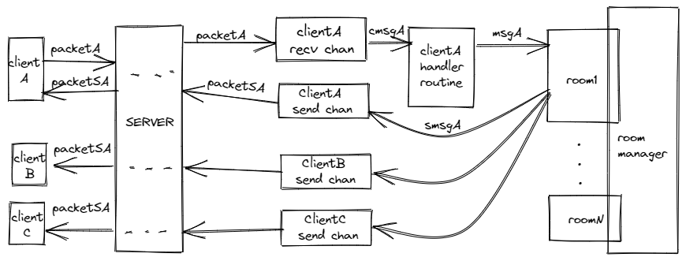

# 基于TCP、Gob序列化的聊天室

## 运行

```bash
# 启动服务器
go run ./cmd/server/main.go
```

```bash
# 启动客户端
go run ./cmd/client/main.go
```

```bash
# 单元测试
go test ./... 
```

```bash
# 性能测试
 go run ./cmd/benchmark/main.go -num 200
 
# 查看CPU性能
 go tool pprof -http=:9999 cpu.pprof
 ```

## 框架设计
  利用channel进行并发操作用户数据的读、写以及逻辑处理。如图:  
   

## 关键算法
1. 脏词过滤：使用AC自动机（Aho-Corasick）做字符串的多模式匹配，根据实际需求仅支持 ASCII，默认忽略大小写并跳过非英文和数字字符。
   - cpu: Intel(R) Xeon(R) CPU E3-1230 V2 @ 3.30GHz
   - 性能1: BenchmarkFilter1:     606.2 ns/op     128 B/op      1 allocs/op
   - 性能2: BenchmarkFilter2:     584.1 ns/op     128 B/op      1 allocs/op
2. 最近高频词：使用队列淘汰过期单词，Hash统计词频。
   - cpu: Intel(R) Xeon(R) CPU E3-1230 V2 @ 3.30GHz
   - 性能: 执行1亿次    2.553s      7108320 B     100034 allocs
3. 离线历史消息：使用官方容器Ring。

## 第三方库
  参考 gotcp(https://github.com/gansidui/gotcp) 对原始TCP协议进行了包装处理

## 优化目标
1. AC自动机，使用纯双数组模式优化CPU缓存命中   
2. goroutine上下文切换成本的控制和内存控制
3. 使用Redis，管理session、组播、最近聊天记录、热词排行
4. 使用Mysql持久化保存用户、聊天室、聊天内容等信息
5. 序列化改为更易用的ProtocolBuffer，使用LZO压缩减少包体大小，提高吞吐量
6. 使用Nginx/LVS做负载均衡，增加网关服务器鉴权及分发消息（隔离内网聊天服务器）
7. 微服务化，使用ETCD做配置中心和服务发现，K8S动态扩容缩容